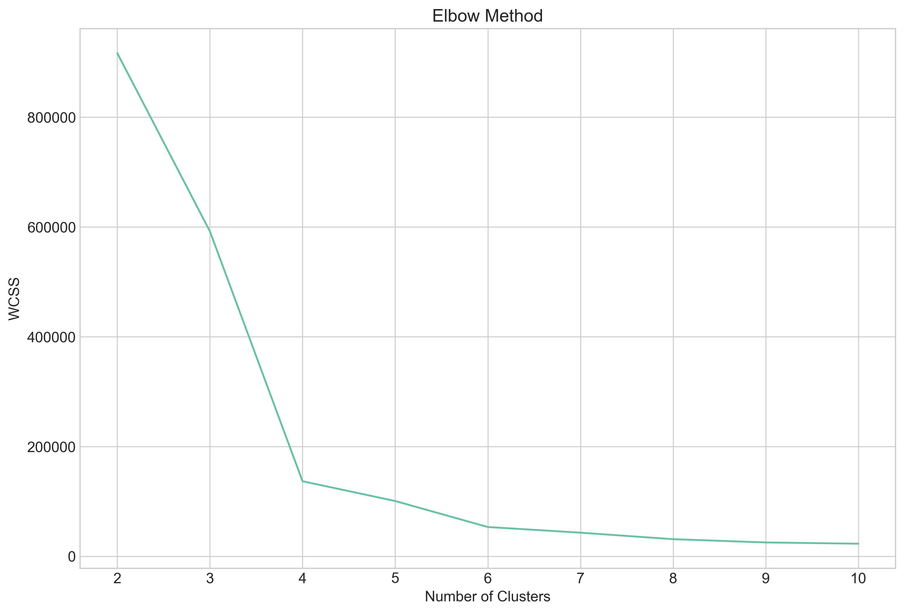

# Membership Grocery Store User Profile Segmentation

An unsupervised machine-learning project that segments grocery-store members according to their purchasing behavior, membership status, digital engagement, and loyalty-program activity.

The analysis compares K-Means, hierarchical clustering, and DBSCAN to identify customer groups that can support targeted marketing, retention, and loyalty strategies.



## Table of Contents

- [Project Structure](#project-structure)
- [Dataset](#dataset)
- [Installation](#installation)
- [Usage](#usage)
- [Methodology](#methodology)
- [Results](#results)
- [License](#license)

## Project Structure

- `notebooks/project.ipynb`: Data preparation, exploratory analysis, feature engineering, clustering, and customer-profile interpretation.
- `notebooks/datasets/membership_groceries/`: Local customer dataset.
- `images/elbow-method.png`: Elbow curve used to select four K-Means clusters.
- `.gitignore`: Excludes local environments, credentials, caches, and notebook checkpoints.

## Dataset

The dataset contains `858` annual customer records from a membership-based grocery store in China. It includes membership tier, auto-renewal, application usage, engagement score, purchase frequency, average basket size, promotion participation, and reward-point activity.

Source: [Membership Groceries User Profile Dataset](https://www.kaggle.com/datasets/anselll09/membership-groceries-user-profile)

Local file:

```text
notebooks/datasets/membership_groceries/membership_groceries_userprofile.csv
```

## Installation

Create and activate a virtual environment:

```bash
python -m venv .venv
source .venv/Scripts/activate
```

Install the dependencies:

```bash
pip install pandas numpy matplotlib seaborn scipy scikit-learn jupyter kaggle
```

## Usage

Open the notebook with Jupyter or VS Code:

```bash
jupyter notebook
```

Then open `notebooks/project.ipynb` and run the cells from top to bottom.

The notebook downloads the dataset through the Kaggle API, prepares the features, generates exploratory visualizations, trains the clustering models, evaluates them, and assigns business-oriented labels to the final K-Means segments.

## Methodology

1. Inspect data types, missing values, duplicates, and descriptive statistics.
2. Encode categorical values and derive `membership_duration` and `reward_points_per_use`.
3. Explore customer distributions and feature relationships.
4. Standardize selected numerical features with `StandardScaler`.
5. Compare K-Means, agglomerative clustering, and DBSCAN.
6. Evaluate cluster quality with the elbow method and silhouette scores.
7. Interpret each cluster using numerical averages and binary-feature proportions.

## Results

K-Means produced the clearest segmentation and was selected for the final analysis:

| Model | Silhouette score |
| --- | ---: |
| K-Means | `0.78196` |
| Hierarchical clustering | `-0.01294` |
| DBSCAN | `-0.02111` |

The final model uses four customer segments:

- **Engaged Standard Members:** Active standard-tier customers with frequent shopping, strong app usage, and regular reward redemption.
- **Engaged Premium Members:** Highly active premium customers with strong digital engagement and loyalty behavior.
- **Disengaged Premium Members:** Premium customers with higher spending per visit but low shopping frequency and limited digital interaction.
- **Disengaged Standard Members:** Low-activity customers with limited app usage, reward redemption, and store engagement.

These profiles can support personalized promotions, premium-member retention, app-adoption campaigns, and customer reactivation strategies.

## License

The original notebook, source code, documentation, and visualizations are released under the [MIT License](LICENSE.md).

The Kaggle dataset is identified as [CC0 1.0](https://creativecommons.org/publicdomain/zero/1.0/). The dataset source is available on [Kaggle](https://www.kaggle.com/datasets/anselll09/membership-groceries-user-profile); attribution is retained here for provenance.
